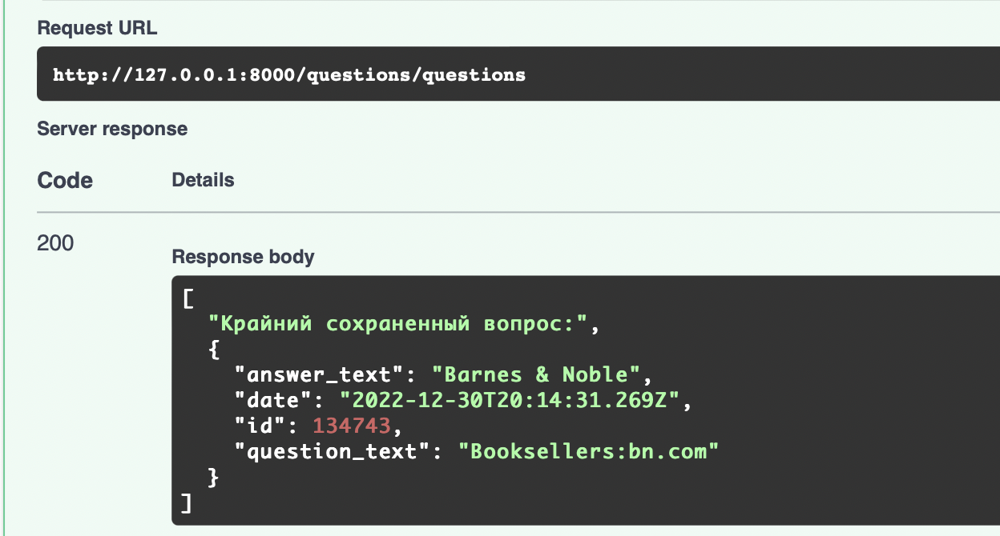

    
    
    
    
    
    

## Клонируем репозиторий:

    git clone https://github.com/Mitsufiro/bewise_task

## Развертывание

`docker-compose up`

## Migrations

При изменении модели данных необходимо создать миграцию

`docker exec app alembic revision --autogenerate -m "New Migration"`

Для применения изменений, необходимо запустить

`docker exec app alembic upgrade head`

## Finally:

• Swagger.

• Подготовлен docker-контейнер с сервисами.

• Загружаются вопросы викторины, неуникальные вопросы отсеиваются и загрузка продолжается пока не достигнет необходимого количества.
    

